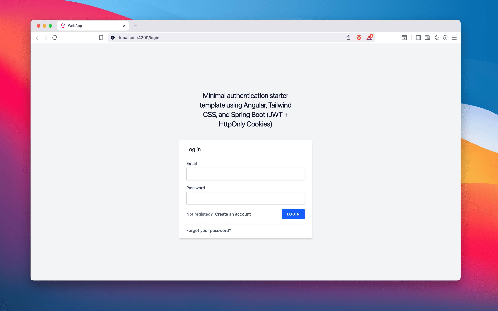
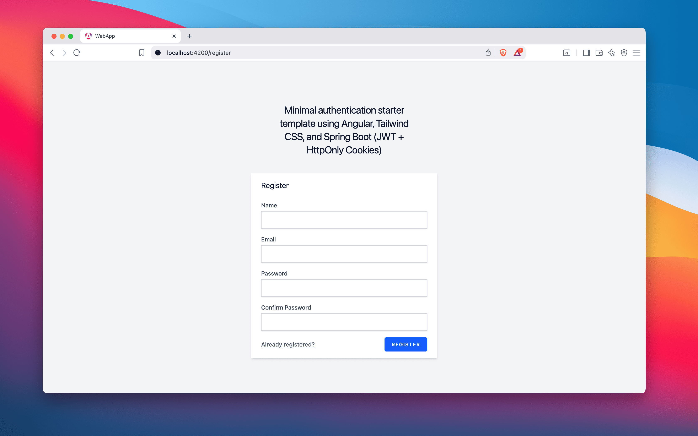
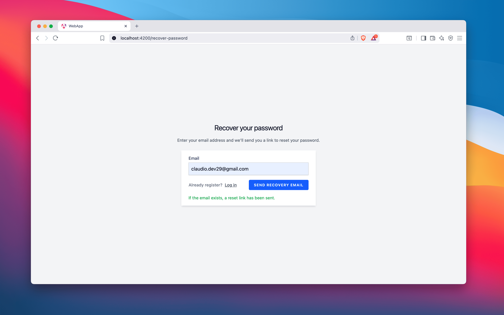
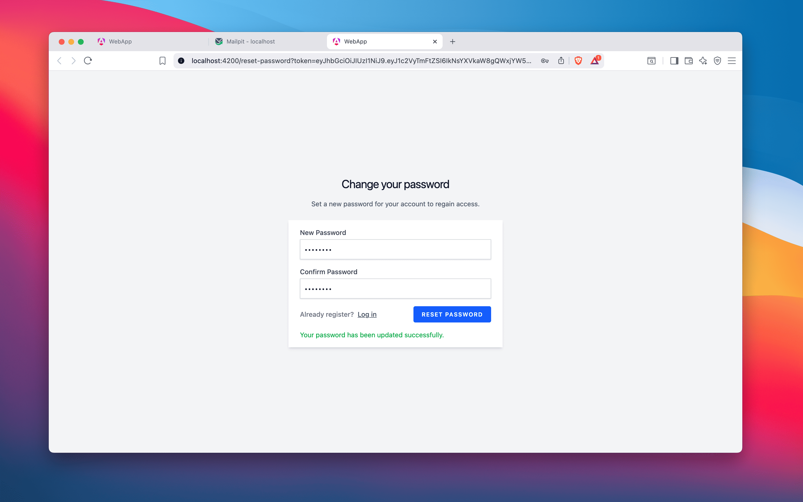
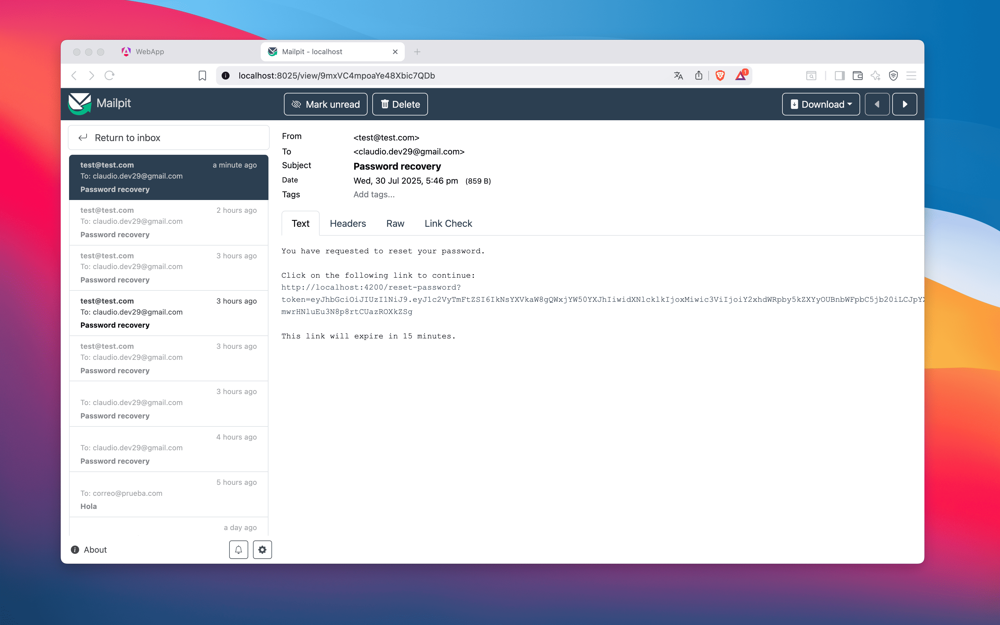
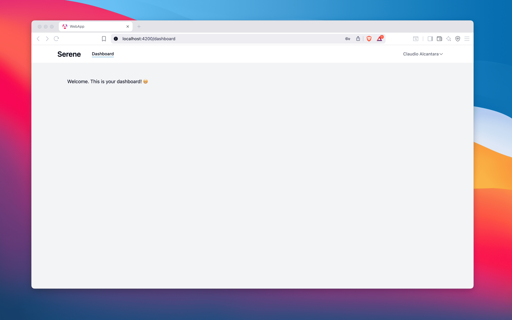
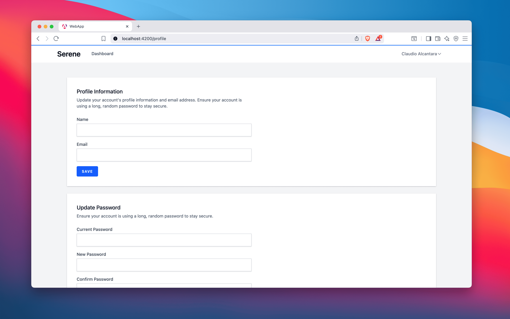
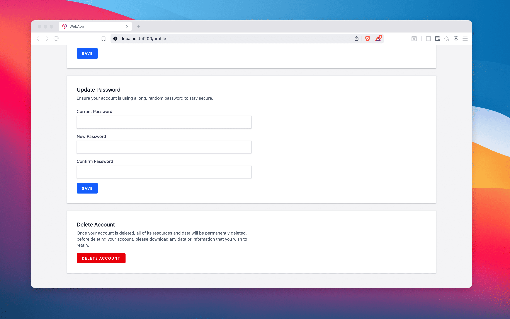
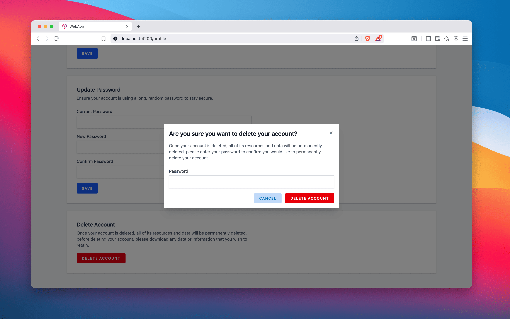

# Serene

**Serene** is a modern StarterKit for full-stack web development using **Spring Boot** and **Angular**. Inspired by Laravel Breeze, it provides a **clean**, **secure**, and **minimalist** foundation so you can focus on building features — not spending time on initial configuration.

---

## 🎯 Problem It Solves

Angular offers powerful capabilities, but it lacks a built-in starter kit with modern features such as JWT authentication, profile management, and best practices like standalone components.  
**Serene fills that gap**, allowing you to focus on business logic from day one without worrying about repetitive setup tasks.

---

## ✨ Features

### 🛡️ Backend (Spring Boot 3)
- JWT authentication (Login, Register, Logout)
- HttpOnly cookie support
- Password confirmation and recovery
- Clean architecture: DTOs, Services, Repositories
- Modular and scalable domain structure
- Docker-ready: MySQL + Mailpit

### 🌐 Frontend (Angular 20 + Tailwind CSS)
- Minimal, beautiful, and responsive UI
- Seamless auth integration with the backend
- Tailwind CSS for rapid and clean styling
- Built with Angular standalone components

---

> **💡 Both frontend and backend are separate projects connected via endpoints. Each project can work independently and includes its own `README.md`.**

---

## 🖼️ Screenshots












---

## ⚙️ Requirements

- Node.js 20+
- Java 21+
- Maven
- Docker (for local MySQL & Mailpit services)

---

## 🚀 Getting Started

### Clone the repository

```bash
git clone https://github.com/your-username/serene.git
cd serene
```

## ❤️ Support
If Serene has saved you time or helped you build more efficiently, consider supporting the project by:

* Giving a ⭐️ on GitHub
* Sharing it with other developers
* Making a small donation

Thank you!


## 📄 License

The MIT License (MIT). Please see [License File](LICENSE.md) for more information.